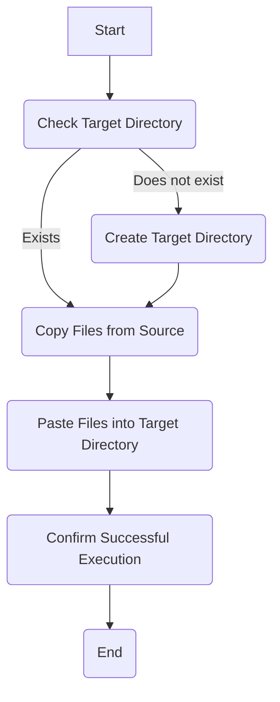

# Description

This project aims to provide a simple tool for backing up multiple reusable configuration files in an 
automated way, bringing them to a centralized repository and enabling the user to install them on their system.

## Update Settings

This bash script (update_settings.sh) automates the backup of specific files from their origin directories to target directories.
It ensures that files are copied from their respective locations to designated backup folders.

## Functions

### `get_in_workspace_target_directory_path()`

Gets the target directory path (Ex: path to Oh-My-Zsh) 
in the directory where the script is running and creates it if it doesn't exist.

### `copy_from_origin_paste_in_target()`

Copies a file from the origin directory to the target directory.

## Usage

To use the script:

1. Modify the script to specify the origin and target directories for the files you want to backup.
2. Run the script using Bash.

### Example

```bash
source update_settings.sh
```

## Script Workflow 

The following Mermaid diagram illustrates the workflow of the script:



## Setup

### Requirements

- Bash (version 4.0+)

### Installation

1. Clone the repository.
2. Ensure executable permissions for the script:

```bash
chmod +x update_settings.sh
```

## Configuration

Modify the script to specify the files and directories you want to backup.

### The required settings are:

1 - Declare your variable and assign the source path of your configuration file.

```bash
file_source_path=~/Example-App/Settings/app_settings_file.txt
```

2 - Declare your variable and assign the target directory, where the configuration file will be sent

```bash
target_directory=$(get_in_workspace_target_directory_path "My-App-Settings-Folder")
```

3 - Add the source variable to sources=() and the target directory to targets=()

```bash
sources=("$file_source_path")
target=("$target_directory")
```

## Demonstration


```bash
# Zsh / Oh-My-Zsh
zsh_zshrc_file_origin=~/.zshrc
zsh_zshrc_target_directory=$(get_in_workspace_target_directory_path "Oh-My-Zsh")

# Visual Studio Code
vscode_settings_json_file_origin=~/.config/Code/User/settings.json
vscode_settings_json_target_directory=$(get_in_workspace_target_directory_path "Visual-Studio-Code")

sources=( 
    "$zsh_zshrc_file_origin" 
    "$vscode_settings_json_file_origin"
)
targets=(
	"$zsh_zshrc_target_directory"
	"$vscode_settings_json_target_directory"
)
```

Feel free to adjust the details as needed for your specific use case and preferences!

